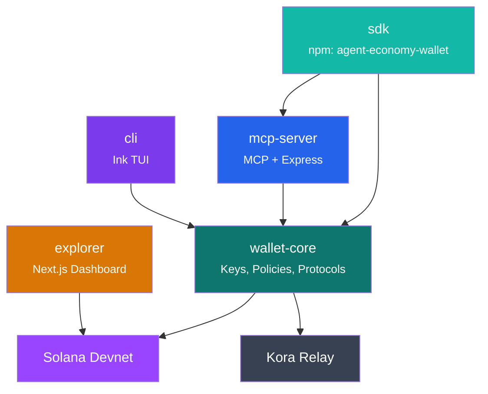
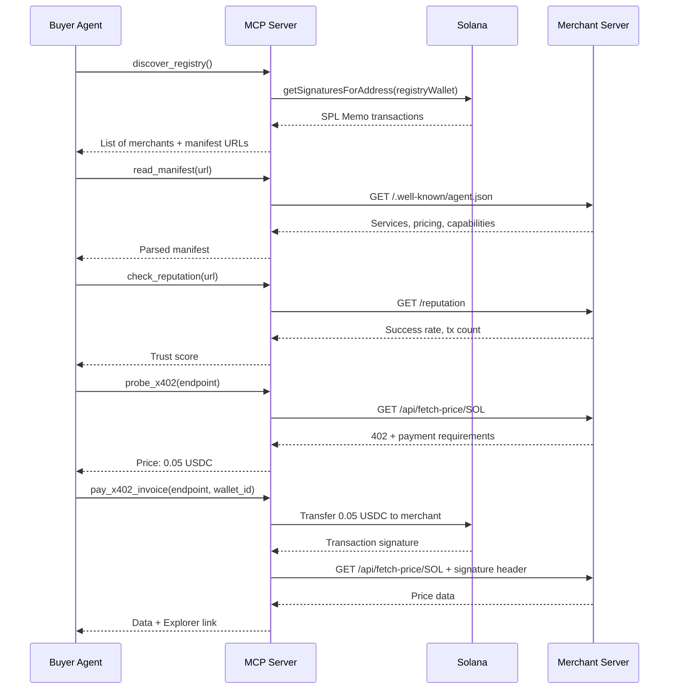

Agent Economy Wallet is a **pnpm monorepo** containing five packages, each with a distinct responsibility. Everything is written in TypeScript (except the optional Kora relay, which is Rust).

## Monorepo Layout

```
agent-economy-wallet/
├── packages/
│   ├── wallet-core/      # Core wallet engine — keys, policies, audit, protocols
│   ├── mcp-server/       # MCP tools/resources/prompts + Express merchant API
│   ├── cli/              # Ink-based TUI for human operators
│   ├── sdk/              # Unified npm package re-exporting the public API
│   └── explorer/         # Next.js dashboard for browsing the on-chain registry
├── kora/                 # Kora gasless relay configuration
├── scripts/              # Utility scripts (Phantom key converter, etc.)
├── docs/                 # This documentation site (Mintlify)
├── Makefile              # Build automation shortcuts
├── docker-compose.yml    # Container orchestration
└── .env.example          # Environment variable reference
```

## Package Dependency Graph



## Package Breakdown

### `wallet-core` — The Foundation

The cryptographic and protocol layer. Every other package depends on this.

| Module | Responsibility |
|--------|---------------|
| `KeyManager` | AES-256-GCM encrypted keystore, keypair generation, PBKDF2 key derivation |
| `WalletService` | Wallet CRUD, balance queries, transaction signing |
| `PolicyEngine` | Per-transaction caps, daily spending limits, whitelist enforcement |
| `AuditLogger` | Tamper-evident log of every action (transfers, policy violations, x402 payments) |
| `MasterFunder` | Auto-funds new agent wallets from an operator-controlled wallet |
| `TransactionBuilder` | Constructs and signs Solana transactions |
| `SplTokenService` | SPL token operations (create mint, mint tokens, transfer, ATA management) |
| `X402Client` | Handles the buyer side of x402 payments (probe, pay, retry) |
| `X402ServerService` | Handles the merchant side (verify payment, anti-replay LRU cache) |
| `RegistryProtocol` | Build and parse SPL Memo registration transactions |
| `KoraService` | Gasless transaction relay via the Kora paymaster |

---

### `mcp-server` — The AI Interface

Exposes the wallet engine to AI agents via the [Model Context Protocol](https://modelcontextprotocol.io), plus runs a concurrent Express API for merchant HTTP endpoints.

**MCP Layer:**
- **18 Tools** — wallet management, transfers, tokens, x402 payments, registry discovery
- **9 Resources** — read-only data streams (balances, audit logs, system status, policies)
- **5 Prompts** — guided workflows (wallet setup, risk assessment, security audit, daily report, x402 payment)

**Express Layer:**
- `GET /.well-known/agent.json` — machine-readable service manifest
- `GET /reputation` — trust signals derived from audit log
- `GET /registry` — on-chain registry of all registered agents
- `GET /api/fetch-price/:token` — x402-gated live token pricing
- `GET /api/analyze-token/:address` — x402-gated token security analysis

---

### `cli` — Human Operator View

An Ink (React-for-the-terminal) TUI that gives operators real-time visibility into their agents:

- Live wallet balances and transaction feed
- Color-coded audit log (green = success, red = policy violation, blue = x402 payment)
- Interactive policy configuration (spending limits, whitelists)
- Secure wallet closure with SOL sweep

---

### `sdk` — The npm Package

A single `npm install agent-economy-wallet` gives external developers access to the full API surface. Re-exports from `wallet-core` and `mcp-server` in a clean public interface.

Three developer personas:
1. **Merchant** — `createX402Paywall()`, `buildRegistrationTx()`
2. **Buyer** — `AgentWallet`, `discoverRegistry()`, `X402Client`
3. **Hybrid** — full API surface

---

### `explorer` — The Dashboard

A Next.js application that reads the on-chain Solana registry and renders a visual directory of all registered agents. Server-side fetched. Deployable to Vercel.

---

## Data Flow: Autonomous Purchase



**No human touched any step.** The agent discovered, evaluated, paid, and received data completely autonomously.
