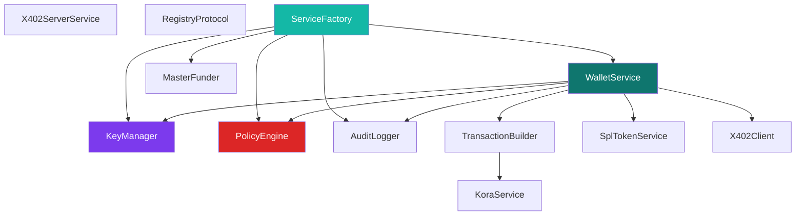

The `wallet-core` package (`packages/wallet-core`) encapsulates all Solana-specific logic, cryptography, guardrails, and protocol-level integrations. Every other package in the monorepo depends on this.

## Architecture



## Sub-Components

### KeyManager (`key-manager.ts`)

Handles secure AES-256-GCM keystore operations.

- **Encryption:** PBKDF2 key derivation (210,000 iterations, SHA-512) from the `WALLET_PASSPHRASE`
- **Keypair generation:** Solana `Keypair.generate()` → encrypted → saved to disk
- **Isolation:** AI agents only see public key references, never raw seed phrases
- **Storage:** `~/.agent-economy-wallet/keys/` directory (`.gitignore`d)

### PolicyEngine (`guardrails/`)

The immutable guardrail for all outbound asset transfers.

- Validates every transaction against human-enforced constraints
- Enforces rolling 24-hour spending windows
- Supports per-transaction caps, daily limits, and hourly rate limits
- Whitelist enforcement for known program addresses
- `HUMAN_ONLY` threshold requiring operator CLI approval

### WalletService (`wallet-service.ts`)

The primary interface for wallet operations.

- Wallet CRUD (create, list, get, close)
- Balance queries (SOL + all SPL tokens)
- Transaction signing and submission
- Auto-funding via MasterFunder on wallet creation
- Policy attachment at creation time

### AuditLogger (`audit-logger.ts`)

Tamper-evident logging of every action.

- Logs all transactions (successful and failed)
- Records policy engine evaluations
- Tracks x402 payment flows
- Distinguishes gasless vs self-paid transactions
- Queryable by wallet ID or globally

### ServiceFactory (`service-factory.ts`)

Simplifies initialization. Loads environment variables and wires up all services into a single `CoreServices` context object:

```typescript
const services = createCoreServices();
// services.wallet, services.keyManager, services.policy, services.audit, ...
```

### TransactionBuilder (`transaction-builder.ts`)

Constructs and signs Solana transactions.

- SOL transfers, SPL token transfers, memo instructions
- Automatic recent blockhash fetching
- Kora relay integration for gasless transactions
- Transaction simulation before submission

### SplTokenService (`spl-token.ts`)

SPL token operations at the protocol level.

- Create token mints with configurable decimals
- Mint tokens to any address
- Transfer SPL tokens with automatic ATA handling
- Query token balances and mint info

### X402Client (`x402-client.ts`)

Buyer-side x402 payment protocol implementation.

- Probe endpoints for payment requirements (amount, mint, address)
- Execute USDC payments and retry with signature headers
- Automatic payment flow orchestration

### X402ServerService (`x402-server.ts`)

Merchant-side x402 payment verification.

- Decode and verify Solana transaction signatures
- Confirm USDC transfer amount and recipient
- Anti-replay LRU cache (prevents signature reuse)
- Express middleware integration

### RegistryProtocol (`registry-protocol.ts`)

On-chain agent registry via SPL Memo.

- `buildRegistrationTx()` — construct a registration memo transaction
- `discoverRegistry()` — scan the blockchain for registered agents
- `getRegistryAddress()` — return the registry coordination wallet

### KoraService (`kora-service.ts`)

Gasless transaction relay integration.

- Sign-and-send via the Kora paymaster node
- Automatic fallback to standard signing if Kora is unavailable
- Fee payer metadata for audit logging
