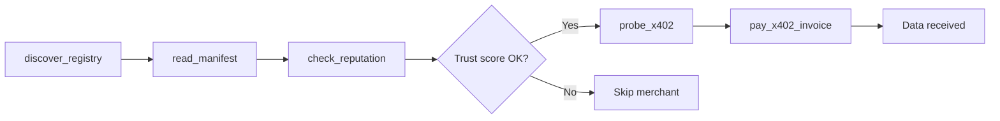

The Discovery toolset allows buyer agents to autonomously find and evaluate merchant agents registered on the Solana blockchain. These tools are read-only and free to invoke.

## `discover_registry`

Scan the Solana blockchain for all registered merchant agents.

- **Input:** None
- **Execution:** Calls `getSignaturesForAddress` on the known registry wallet, parses SPL Memo transactions, and filters for valid `{"agent":"...","manifest":"...","v":1}` entries.
- **Returns:** Array of discovered agents, each containing:
  - `name` — agent name from the memo
  - `manifest_url` — URL to the merchant's service manifest
  - `wallet` — the merchant's Solana wallet address
  - `signature` — the registration transaction signature
  - `timestamp` — when the registration occurred

<Tip>
  The registry lives entirely on-chain. There is no database, no API key, and no rate limit. If every server goes offline, any buyer can reconstruct the full registry from a single Solana RPC call.
</Tip>

## `read_manifest`

Fetch and parse a merchant's machine-readable service manifest.

- **Input:**
  - `manifest_url` — URL from `discover_registry` results (typically `/.well-known/agent.json`)
- **Execution:** HTTP GET to the manifest URL, parses the JSON response.
- **Returns:** Merchant metadata including:
  - Agent name and description
  - Available services (name, endpoint, price, payment token)
  - Contact and support information
  - Capabilities and version

## `check_reputation`

Evaluate a merchant's trustworthiness via their reputation endpoint.

- **Input:**
  - `reputation_url` — typically `https://merchant-domain.com/reputation`
- **Execution:** HTTP GET to the reputation endpoint.
- **Returns:** Trust signals including:
  - `success_rate` — percentage of successful transactions
  - `total_transactions` — total number of completed sales
  - `uptime` — server availability metrics
  - `recent_activity` — timestamps of recent transactions

<Note>
  Reputation data is derived from the merchant's local audit log. A buyer agent should cross-reference multiple trust signals (reputation endpoint + on-chain tx history + manifest freshness) before committing to a purchase.
</Note>

## Typical Buyer Flow

